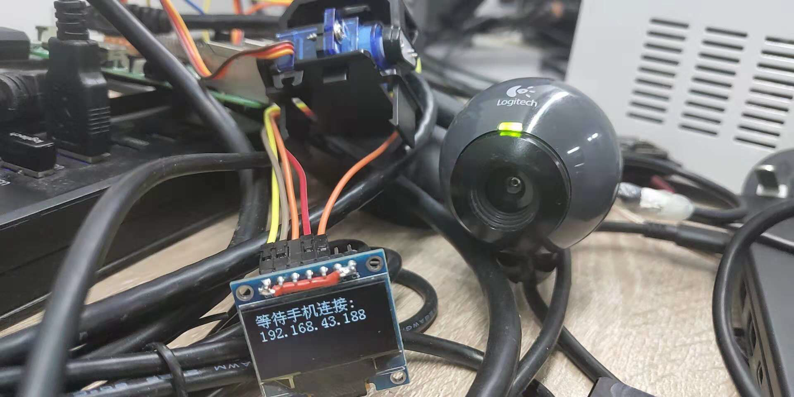
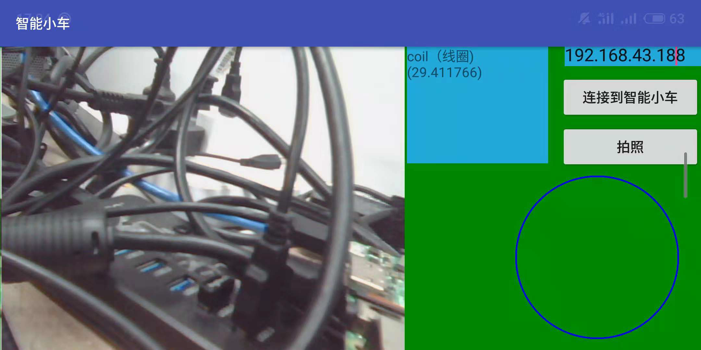
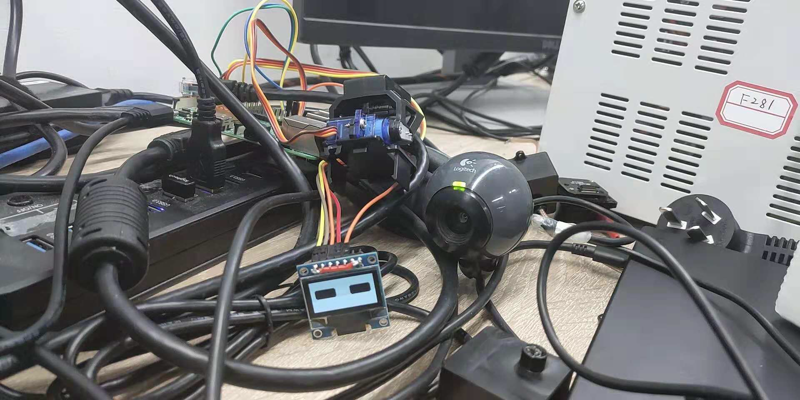

# androidThingsRobot

Summary:

 工程基于RaspberryPi3 ModelB+开源硬件平台，使用Google最新Android Things1.3为软件系统，实现了一系列的设计开发，为自家孩子设计一款玩具。本意为智能车或者智能设备爱好者提供一些参考，如果大家有好的ideas或者商业用途，都可以联系我，非常感谢！
 工程开发了一套Andord手机客户端，以此来显示视频监听，运动控制和图像识别结果显示等功能，具体如下链接：
  https://github.com/jueying8888/androidThingsRobotClient.git
 

 1，驱动电机，使用L298，通过四根线控制H桥的两路电机正反转；
    技术：申请并控制四个gpio
	底盘链接：https://item.taobao.com/item.htm?spm=a1z10.5-c-s.w4002-18248862335.46.bb922829cCwFzx&id=554760842957

 2，驱动OLED SSD1302显示屏，显示英文，中文，图像，gif图像
    技术：1,硬件购买的是OLED的设备，SPI接口，后来调整为I2C接口。需要注意，必须控制复位管脚，在所有通信前要对其进行大于100ms的复位后才可以正常通信。
	     2,移植github上的oled驱动，基于java类;
	     3,下载GB2312点阵字库，ASCII点阵字库;
	     4,加载并驱动点阵字库，字符库放在asset目录下;
	     5,移植gif解码，解出多个frame，每个frame拿到后resize到OLED分辨率大小，并显示出来；

 3，web页面移植
    背景：目前Android开源比较好的web页面是 andserver，移植后可以响应多种页面，包括下载; andserver是基于HTTP最原始的通信，界面是直接编写HTML语言，实现简单的界面可以参考HEML语法进行; 目前实现了登陆界面，控制界面，实时刷新图像到web页面;

 4，USBCamera移植
    背景：在Android Things上，默认的Raspberry Pi3不支持USBCamera，主要是framework不支持，底层驱动支持，也可以识别出/dev/video0设备，只能自己写hal层识别设备。
    技术：1，移植V4L2，在android things系统上跑，需要编写C++代码，android studio安装为3.1版本，安装cmake，ndk后即可编写本地代码; 编写HAL层代码实现video0的所有操作，编写jni层，实现JAVA端控制camera的启停，监听和数据的获取;
	     2，video0没有权限进行读写操作问题，手动修改 chmod 0666 /dev/video0后可以使用；但是不能每次重启都修改，所以直接修改SD卡系统下的配置文件;将SD卡放入linux系统下，挂在所有盘，在/etc/下找到uevent.rp3.rc文件，修改为 chmod 0666 /dev/video* system system。

 5，tensorflow实例移植
     背景：目前tensorflow对嵌入式设备做了针对的优化，是一个lite版本，通过libtensor.so加载。
     技术：1，移植tensorflow classifier工程，即图像分类；默认工程是调用android的camera类加载图像;
          2，Resize图像为244*244分辨率格式后输入给tensorflow;
          3，修改camera接口，调用我们的USBCamera，最终实现了图像的加载和识别。
 
 6，Socket通信
     背景：智能小车增加了人机交互功能，通过WIFI与Android手机客户端交互，实现了图像，控制等一系列互交操作。
     技术：通过TCP与客户端通信，由于传输数据种类不同，目前只是做了简单传输协议，不同数据结尾增加不同结束符，在接收端进行整体解析即可进行双向通信。

 7，Android Things平台搭建注意事项：
    在开发阶段，使用：
                    category android:name="android.intent.category.LAUNCHER"
    在发布阶段，使用如下配置，实现自启动
                    category android:name="android.intent.category.HOME"
                    category android:name="android.intent.category.DEFAULT"

 
    第一次调试Android Things时使用网线的形式，如果有Wifi，可以adb进入后配置Wifi，配置如下：
    adb shell am startservice -n com.google.wifisetup/.WifiSetupService -a WifiSetupService.Connect -e ssid TP-LINK-007 -e passphrase 12345678

 8,开发阶段图像预览	
    ## Wait phone connect
    
    ## Client connnect
    
    ## Smart car emoticon
    
    ## Smart car
    

  
License
-------

      Copyright 2016 Cagdas Caglak

      Licensed under the Apache License, Version 2.0 (the "License");
      you may not use this file except in compliance with the License.
      You may obtain a copy of the License at

      http://www.apache.org/licenses/LICENSE-2.0

      Unless required by applicable law or agreed to in writing, software
      distributed under the License is distributed on an "AS IS" BASIS,
      WITHOUT WARRANTIES OR CONDITIONS OF ANY KIND, either express or implied.
      See the License for the specific language governing permissions and
      limitations under the License.

